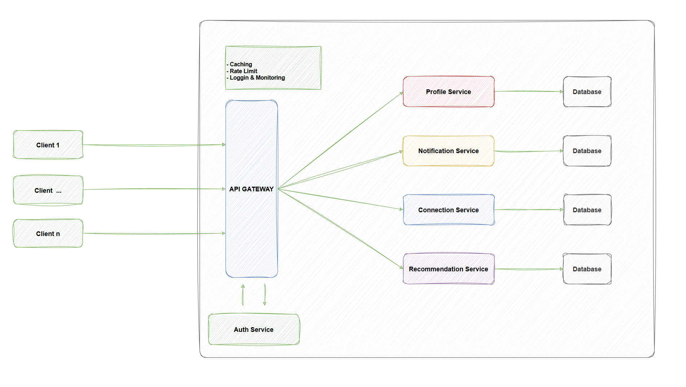

<h2 align="center">
   DOMAIN DRIVEN DESIGN - LINKEDHUB APPLICATION
</h2>

<h4 align="center">A professional networking platform inspired by LinkedIn.</h4>

<p align="center">
  <a href="https://spring.io/projects/spring-boot">
    
  </a>
  <a href="https://spring.io/projects/spring-security">
    
  </a>
  <a href="https://maven.apache.org/">
    
  </a>
  <a href="https://spring.io/projects/spring-cloud-gateway">
    
  </a>
  <a href="https://kafka.apache.org/">
    
  </a>
  <a href="https://spring.io/projects/spring-cloud-bus">
    
  </a>
  <a href="https://www.docker.com/">
    
  </a>
  <a href="https://kubernetes.io/">
    
  </a>
  <a href="https://www.rabbitmq.com/">
    
  </a>
  <a href="https://redis.io/">
    
  </a>
</p>
<p align="center">
  <a href="#key-features">Key Features</a> •
  <a href="#how-to-use">How To Use</a> •
  <a href="#download">Download</a> •
  <a href="#credits">Credits</a> •
  <a href="#related">Related</a> •
  <a href="#license">License</a>
</p>

### 📋 Overview
<h5 align="left">
   LinkedHub is a professional networking platform inspired by LinkedIn, designed and developed using Domain-Driven Design (DDD) principles and a microservices architecture. The project leverages Java Spring Boot to build scalable, maintainable, and loosely coupled services. This repository contains the backend implementation of the LinkedHub system.
</h5>

### 🏗️ Project Structure

The project is organized into multiple microservices, each focusing on a specific domain of the application. Below is the structure of the modules:

- 🔐 **auth-service**: Handles user authentication, registration, and login functionalities.
- ⚙️ **config-service**: Manages centralized configuration for all microservices (e.g., using Spring Cloud Config).
- 🌍 **eureka-service**: Provides service discovery and registration using Netflix Eureka for microservices communication.
- 🚪 **gateway-service**: Acts as an API Gateway to route requests to appropriate microservices and handle cross-cutting concerns like security and load balancing.
- 👤 **profile-service**: Manages user profiles, including personal information, skills, and experiences.

#### 📂 Additional Files

- 🐳 **docker-compose.yml**: Defines the setup for running all microservices and their dependencies (e.g., databases, Eureka) using Docker.
### 🛠️ Architecture 



<h4 align="center"> Diagram illustrating the microservices architecture of LinkedHub.</h4>


#### 🛠️ Technologies Used

- ☕ **Java Spring Boot**: For building RESTful microservices.
- ☁️ **Spring Cloud**: For microservices features like service discovery (Eureka), API Gateway, and centralized configuration.
- 🐳 **Docker**: For containerization of services.
- 📦 **Maven**: For dependency management and building the project.

### 🚀 Getting Started

#### ✅ Prerequisites

- Java 17 or higher
- Maven
- Docker and Docker Compose
- IDE (e.g., IntelliJ IDEA, Eclipse)

#### 🛠️ Setup Instructions

1. **Clone the Repository**:

   ```bash
   git clone <jpa-url>
   cd linkedhub
   ```

2. **Build the Project**:

   ```bash
   mvn clean install
   ```

3. **Run the Services Using Docker**: Start all microservices and their dependencies using Docker Compose:

   ```bash
   docker-compose up --build
   ```

4. **Access the Services**:

   - 🌐 API Gateway: `http://localhost:8080`
   - 📊 Eureka Dashboard: `http://localhost:8761`

#### 🖥️ Running Locally Without Docker

1. Start the `config-service` first to load configurations.
2. Start the `eureka-service` for service discovery.
3. Start the `gateway-service`, `auth-service`, and `profile-service` in any order.
4. Use an API client (e.g., Postman) to interact with the services via the API Gateway.

### 🔮 Future Enhancements

- Add more microservices for features like job postings, messaging, and news feed.
- Integrate a database for each microservice (e.g., PostgreSQL, MongoDB).
- Implement CI/CD pipelines for automated deployment.
- Add unit and integration tests for each service.

### 🤝 Contributing

Contributions are welcome! Please fork the repository, create a feature branch, and submit a pull request for review.

### 📜 License

This project is licensed under the MIT License - see the LICENSE file for details.

---

🌟 **Happy Networking with LinkedHub!** 🌟